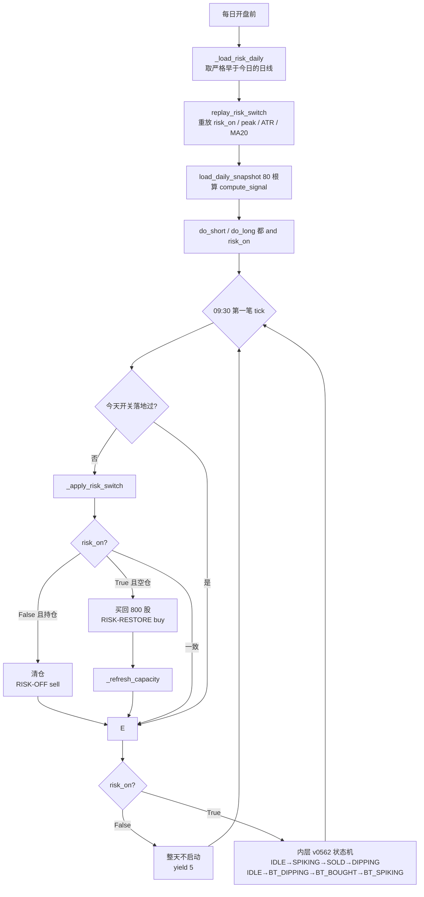

# DayT_v0563 原理、流程与实测结果

策略文件：`Stragety/MiniQMT_Stragety/DayT/DayT_v0563_CoreT_ATRReentry_TrendGuard.py`
注册别名：`v0563`
前作：[`DayT_v0562_CoreT_ATRReentry.py`](../Stragety/MiniQMT_Stragety/DayT/DayT_v0562_CoreT_ATRReentry.py)（日内内核）
          [`CaptureT_v4_原理说明.md`](CaptureT_v4_原理说明.md)（外层的出处）

---

## 一、这次改的是什么

v0562 是纯日内：反T + 正T + ATR 重锚，全部风险控制都在**交易时段内**。
它的底仓假设只有一条——**底仓一直在**。

这条假设的代价，CaptureT_v4 已经在同一只标的、同一段时间上量过一次：601869 从
**6/24 的 579.71 跌到 8/3 的 262 附近，回撤 −54.8%**，底仓在这波里蒸发的钱，
比日内做 T 全年赚到的钱多一个数量级。

v0563 就是把 v4 的**外层**——日线 ATR 跟踪止损 + MA20 回场——原样融进 v0562。
**内层一行没改**：`compute_signal`、`confirmed_short_reversal`、
`calculate_atr_reentry`、REV-T/FWD-T 阶梯、`calculate_t_shares` 全部保留。

---

## 二、两层结构

```
┌─ 外层：日线风控开关 ───────────────────────────── 每天一次 ─┐
│  数据：日线 OHLC（严格早于今日）                            │
│  决定：今天底仓该不该在（risk_on ∈ {True, False}）          │
│  动作：清仓（RISK-OFF sell）/ 回场（RISK-RESTORE buy）      │
├─ 内层：v0562 日内做T ─────────────────────────── 每分钟一次 ─┤
│  数据：当日 1 分钟线 / tick                                 │
│  决定：反T、正T 的触发价                                    │
│  动作：REV-T / FWD-T 开平仓                                 │
└─────────────────────────────────────────────────────────────┘
```

**外层是主**：`risk_on = False` 的交易日，内层整天不启动。
落地方式是三处闸门：

1. `_daily_init()` 里 `do_short` / `do_long` 都再 `and risk_on`；
2. `_new_leg_block_reason()` 在 risk-off 时返回拦截原因；
3. 主循环在风控判定后直接 `continue`，状态机根本不进。

---

## 三、外层：日线风控开关

### 3.1 三个量，全部只用「截至昨日」的日线

| 量         | 算法                         | 说明           |
| ---------- | ---------------------------- | -------------- |
| ATR(14)    | 近 14 日 `(high − low)` 均值 | 当日的波动尺度 |
| **peak**   | 历史最高**收盘价**           | 跟踪止盈的锚   |
| MA20       | 近 20 日收盘均值             | 回场的门槛     |

阈值：`止损线 = peak − K_ATR × ATR`，`K_ATR = 3.0`。

### 3.2 状态机（两个状态）

| 状态            | 含义                    | 迁移条件                                             |
| --------------- | ----------------------- | ---------------------------------------------------- |
| `risk_on=True`  | 持有底仓，日内可以跑 T  | 昨收 < `peak − 3×ATR` → `risk_on=False`（清仓）   |
| `risk_on=False` | 空仓，日内不做 T        | 昨收 > `MA20` → `risk_on=True`（买回 800 股） |

**出场用 ATR 跟踪止损，进场用均线**。不对称设计，有意为之：出场要快，跌破就认；
进场要慢，必须站上均线才算企稳，避免下跌中途反复接刀。

### 3.3 关键工程点：开关不存，每天早上重放出来

本系列有硬约束：**每个交易日重建策略实例，任何跨日状态全部丢失。**

v0563 沿用 v4 的解法——**把开关状态定义成日线序列的纯函数**：

```python
def replay_risk_switch(highs, lows, closes):
    risk_on, peak = True, close[0]
    for i in range(n):
        peak = max(peak, close[i])
        atr  = mean(high[i-13:i+1] - low[i-13:i+1])
        ma   = mean(close[i-19:i+1])
        if risk_on:
            if close[i] < peak - 3*atr: risk_on = False    # 触发止损
        elif close[i] > ma:            risk_on = True      # 回场
    return {'risk_on': risk_on, 'peak': peak, 'atr': ..., 'ma20': ...}
```

这是模块级函数，不是方法——**同样的日线序列永远给同样的答案**，所以
不需要跨日保存任何东西；也正因为是纯函数，回测报告可以独立复算一遍来对账。

样本不足或价格非正时返回 `None`，调用方按 **fail-open**（`risk_on=True`，
今天不加保护）处理：**日线取不到就把底仓清掉，是比不加保护更糟的失败方式。**

### 3.4 无未来函数

- `load_daily_snapshot` 在回放框架里自带断言，保证返回的最后一根日线**严格早于当日**；
- 信号在**开盘前**算完，订单在当日**第一笔可交易 tick** 成交；
- 每个交易日的开关只落地一次（`risk_switch_done` 标记）。

---

## 四、三处必须改的地方

### ① 风控腿不进 `ExecutionBook`

`ExecutionBook` 随每日重置一起重建，而风控的一条腿可能跨好几天（今天清仓、
半个月后才回场）。昨天的 `RISK-OFF` 记录今天已不存在，`RISK-RESTORE` 会被判成
「平掉不存在的腿」直接抛错。风控的盈亏本来就体现在账户权益里，不需要也不应该
由 T 台账记账。`_wait_for_fill` 因此对 `RISK_LABELS` 分支跳过记账。

### ② 锁仓时风控腿也不许动

`_daily_init` 在日线不可用时调 `_lock_all_trading`。若风控开关在那一刻恰好算出
`risk_on=False`，就会在「交易已整体关闭」的状态下清仓。`_apply_risk_switch`
因此在最前面挡一道锁仓检查。

### ③ 回场股数是**声明参数**，不是账户推出来的

`BASE_TARGET_SHARES` 取初始底仓股数。这一条是本次融合最需要警惕的地方，见第六节。

---

## 五、运行流程图



**一天：**

```
时间轴  09:30 ──────────────────────────────────────────────── 15:00
        │                                                          │
  外层   │◄ 开盘前已算好 ─┤ 09:30 第一笔 tick 执行清仓/回场         │
  内层   │← risk_on=True 才启动，否则整天不出手 →│                 │
```

---

## 六、⚠️ 融合后暴露的真问题：外层保护的是「账户实际持股」，不是「底仓」

这是本次融合最重要的发现，也是 v0562 与 CaptureT_v1 的结构差异造成的。

v4 的内层是「卖光底仓 / 买回底仓」，账户股数**永远恰好是 800**，所以外层的
「清仓 = 卖 800 股、回场 = 买 800 股」自洽。

v0562 的内层不同：它按比例开新 T 腿，**未闭合的腿会跨日留在账户里**，持股数会漂。

实测漂移：

| 日期 | 账户持股 |
|---|---:|
| 20260105（首日） | 1,200 |
| 20260702（崩盘前夜） | **300** |
| 20260703（触发清仓） | 卖 300 → 0 |
| 20260811（回场） | 买 800 → 800 |
| 20260918（期末） | 800 |

**所以 07-03 那次「清仓」实际只躲开了 300 股的敞口，不是 800 股。**
而 08-11 回场又按声明的 800 股买回，完整吃到了 8 月的反弹。

两个后果，都必须写在明面上：

1. **崩盘保护被打了折。** 外层在崩盘里躲开的钱，对应的是当时的实际持仓，
   而不是名义底仓。漂移越小，外层越接近设计意图；漂移越大，外层越像半个开关。
2. **回场是「买回 800 股」这一条独立假设。** 它不是账户推出来的，
   和清仓前的持仓无关。融合两层时这是一个需要显式决策的参数，不是自然结果。

如果要把这一条做实，正确方向是让内层维护一个**跨日持股基准**（v4 的做法是
内层自己保持恒定的底仓），或者让外层记录清仓时的股数——后者与「每日重置、
不存状态」的约束直接冲突，所以真正可行的是前者。

---

## 七、参数

| 参数                   |            值 | 作用             | 为什么是这个值                                       |
| ---------------------- | ------------: | ---------------- | ---------------------------------------------------- |
| `RISK_LAYER_ENABLED`   |     **True** | 外层总开关       | `False` 时退化为纯 v0562，仅供研究对照             |
| `RISK_PEAK_MODE`       | **'MARKET'** | peak 语义        | v4 原版；`'REENTRY'` 已实现并**已否定**，见 7.1    |
| `RISK_ATR_PERIOD`      |       **14** | 波动尺度窗口     | 教科书默认，与 v4 一致，未搜索                       |
| `RISK_K_ATR`           |      **3.0** | 止损的 ATR 倍数  | 教科书默认；v4 扫过 1.0~6.0，**k ≥ 2.0 整段为正** |
| `RISK_MA_REENTRY`      |       **20** | 回场门槛         | 教科书默认，与 v4 一致                               |
| `RISK_DAILY_LOOKBACK`  |      **280** | 取多少根日线重放 | 覆盖任意长度的清仓期                                 |
| `BASE_TARGET_SHARES`   |      **800** | 回场买回多少股   | 回测按初始底仓覆盖；见第六节                       |

内层参数与 v0562 完全相同，未做任何调整。

### 7.1 `RISK_PEAK_MODE`：一个已实现、已测、已否定的备选

外层有一个不显眼的假设——**peak 永不重置**。崩盘后再起一波行情时，止损线
仍挂在崩盘前那个顶上。601869 上这直接造成 8 月后每天翻仓：现价 455 夹在
`MA20 424` 与 `止损线 500.85` 之间，08-04 之后 34 个交易日里 30 天收在带内。

由此提出第二种读法：

| 模式            | peak 的含义                        | 语义                     |
| --------------- | ---------------------------------- | ------------------------ |
| `'MARKET'`    | 重放窗口内收盘价的运行最高值，**永不重置** | 「市场离它的高点有多远」 |
| `'REENTRY'`   | 每次「空仓→回场」时重置为回场价      | 「当前这手持仓的高水位」 |

**A/B 结论：不改默认，保持 `'MARKET'`。** 完整报告见
[`timing_lab_peak_mode_20260921/README.md`](timing_lab_peak_mode_20260921/README.md)，
判据在看结果前定下（看配对差中位与跨年符号一致性，不看单条样本）：

| 检验                             | 结果                                        | 通过 |
| -------------------------------- | ------------------------------------------- | ---- |
| 横截面 13 标的：配对差中位       | **−2.04%**（4/13 为正）                    | 否   |
| 横截面：开关为正的标的数         | 11/13 → **4/13**                          | 否   |
| 面板 45,085 观测：配对差中位     | +0.97%                                      | 边际 |
| 面板：配对差为正的年份           | 8/13                                        | 边际 |
| 面板：**按年聚类 t**       | **1.83**（< 2.0）                         | 否   |
| 面板：绝对超额                   | MARKET −5.99%、REENTRY −1.98%，**都是负的** | —    |

两点值得单独记下：

- **崩盘保护两边完全相同。** 崩盘时仓位是崩盘前开的，高水位就是当时的顶，
  所以 6/24–8/3 那一段两种模式的超额逐位相同（+158,160）。
  **差异全部出现在「回场之后」。**
- **它没有改变规则的本质。** `corr(当年持有收益, 当年开关超额)` 由 −0.92 变到
  −0.94，仍然是「下跌年份才值钱」的趋势跟随。它换的是赚多少，不是像不像。
- **横截面与面板不矛盾。** 横截面跑的是 2026 年，面板的 2026 切片也是负的
  （−2.83%）。两项检验在你关心的那一年上结论一致：REENTRY 更差。
  面板总体的 +4.01% 来自 2015、2019–2022、2024–2025。

机制上：回场即重锚 = 止损线从 `前高 − 3×ATR` 变成 `入场价 − 3×ATR`。
入场价远低于前高，**离场要等更深的回撤**。在震荡下行里，MARKET 那种
「反复翻仓」本身就是保护；601869 在 2026 是 V 型反转，所以坐住是对的——
**单条 V 型样本无法区分这两者，这正是要做面板的原因。**

---

## 八、实测结果

口径：601869.SH，初始 800 股 + 10 万现金，初始总资产 194,400 元；
20260105—20260918 共 **174 个交易日**；1 分钟线取自 **RedisQMT 桥接**
（唯一数据源，`data_1m_redisqmt.csv` / `data_1d_redisqmt_front.csv`）；
每日重建策略实例、账户连续；单边费用 0.05%，滑点 0。

### 8.1 总览

| 策略                |             期末资产 |         相对一直持有 |     期末股数 | 成交笔数 | 风控成交 |   总费用 |
| ------------------- | -------------------: | -------------------: | -----------: | -------: | -------: | -------: |
| **v0563（加外层）** | **515,348.93** | **+51,356.93** |          800 |      280 |       34 | 12,560.07 |
| v0562（纯日内）     |           417,187.66 |           −46,804.34 |          200 |      422 |        — | 12,130.34 |
| `v0563_nolayer`   |           417,187.66 |           −46,804.34 |          200 |      422 |        — | 12,130.34 |

一直持有对照：**463,992.00 元**（持有期损益 +269,592.00）。

**加一层外层，把 v0562 的 −46,804 变成 +51,357，摆动 +98,161 元。**
这也是本系列 v056x 各版本中，第一次在这段窗口上**跑赢一直持有**。

**`v0563_nolayer` 与 `v0562` 逐笔成交完全一致**（脚本内断言
`control_matches_baseline: True`）。这是本次对比成立的唯一凭据：
外层是两组数字之间**唯一**的变量。

### 8.2 钱是从哪来的：三段拆解（按最长的一次连续 risk-off 切）

| 区间                                      | 交易日 | v0563 账户变化 |       一直持有变化 |         **差** |
| ----------------------------------------- | -----: | -------------: | -----------------: | -------------------: |
| ① 01-05 → 07-02（上涨段）              |    118 |       +241,612 |           +277,096 |   **−35,483** |
| ② 07-03 → 08-10（**空仓 27 个交易日**） |     27 |       **−1,380** |        **−97,024** |   **+95,644** |
| ③ 08-11 → 09-18（回场后）              |     29 |        +83,451 |            +89,520 |    **−6,068** |

**这张表是整个策略最诚实的一张：**

- **① 上涨段 v0563 输给持有 35,483 元。** 1 月那两次清仓（01-13、01-23）被反复打脸，
  手续费也在烧。
- **② 崩盘段 v0563 赚了 95,644 元。** 它空仓度过（账户只动了 −1,380，全是手续费），
  而持有蒸发了 97,024。**三段合计 +54,092，这一段的贡献是全部超额的 177%。**
- **③ 回场后 v0563 又输给持有 6,068 元。** 8 月 11 日之后共 **29 次**风控事件，
  几乎每个交易日翻一次仓。

> **一句话：v0563 在两端（上涨、震荡）都在输钱，全部的赢面来自中间那 27 天的空仓。**
> 这不是一个「持续有效」的策略，是一个**用两次小额亏损买一次崩盘保险**的策略。

### 8.3 8 月后的翻仓 churn

08-11 之后 29 个交易日里，开关**每天翻一次**：

```
08-11 ON → 08-12 OFF → 08-13 ON → 08-14 OFF → 08-17 ON → 08-18 OFF → ...
```

这段 churn 的毛效果接近打平（③ 段 −6,068），但**风控腿累计吃掉 4,886.84 元手续费，
占全部费用的 38.91%**。这正是「躲开一次崩盘」在更长尺度上可能退化的形态。

### 8.4 分方向统计

| 策略   | 方向 | 已闭合周期 | 胜率   | 已闭合股数 |     毛收益 |     净收益 | 未闭合腿 |
| ------ | ---- | ---------: | ------ | ---------: | ---------: | ---------: | -------: |
| v0562  | 反T  |         70 | 98.57% |     15,400 |     69,588 |  64,912.71 |       33 |
| v0562  | 正T  |        103 |   100% |     17,800 |     74,490 |  69,196.83 |       43 |
| v0563  | 反T  |         35 |   100% |      9,000 |     37,076 |  34,418.56 |       19 |
| v0563  | 正T  |         65 |   100% |     12,200 |     52,424 |  48,738.21 |       27 |

v0563 的 T 交易量约为 v0562 的 **64%**——空仓日不做 T，是外层的直接后果。

---

## 九、必须一起读的四条限定

### ① 收益来自一次事件

48 个 risk-off 交易日里，真正的资金贡献只有 07-03 → 08-10 那一段（+95,644）。
其余（01-13/01-23 的两次清仓、08-11 后的 29 次翻仓）合计**亏 41,551 元**。
样本期 8.5 个月只包含**一次** −54.8% 的崩盘，没有第二个独立事件可验证。

### ② 崩盘保护被打折（见第六节）

07-03 清仓时账户只剩 **300 股**，不是 800 股。外层躲开的敞口是实际持仓那一份。

### ③ 期末股数不同

v0562 期末 200 股、v0563 期末 800 股。两边都按最后收盘价市值计价，口径一致，
但**最后一天的市值会把股数差放大**。评价差距必须同时看「现金 + 股数」。

### ④ v4 的跨标的检验已经做过，且不通过

`CaptureT_v4_原理说明.md` 第八、九节：把完整的 v4（同样的外层）套到 11 个其它
标的上，**t = 1.58、中位 +780 元、有效样本数只有 3.6**；在 5,129 只 × 12 年的
全市场面板上，平均开关超额 **−5.99%**，逐年 `corr(持有收益, 开关超额) = −0.98`。

> **外层是同一套规则，所以那套否定证据原样适用于 v0563。**
> +51,357 是「601869 × 2026 上半年」这个组合的产物，不是策略的可移植证明。

---

## 十、一句话总结

**v0563 = v0562 的日内内核 + CaptureT_v4 的日线 ATR 跟踪止损开关（原样融合）。
实测把 v0562 的 −46,804 元翻成 +51,357 元，首次跑赢一直持有（463,992 元）。
但三段拆解显示：上涨段输 35,483、回场后输 6,068，全部赢面（+95,644）来自中间
27 天的空仓；而且清仓当天账户只剩 300 股，实际躲开的敞口小于名义底仓。
它本质上仍是一个「有趋势时赚钱、无趋势时赔钱」的趋势跟随开关，
v4 已有的跨标的与跨年份否定证据原样适用。**

---

## 十一、复现

```powershell
# 完整回测（RedisQMT 取数 + 三列对照 + 报告）
python analysis/backtest_v0563_trendguard_redis_20260921.py

# 只按已保存的 results.json 重出报告，不重跑回放
python analysis/backtest_v0563_trendguard_redis_20260921.py --render

# 外层纯函数的单元测试
python -m pytest tests/test_dayt_v0563_trend_guard.py -q

# peak 语义 A/B（单标的 + 13 标的横截面 + 全市场 12 年面板）
python analysis/timing_lab_peak_mode_20260921.py
python analysis/timing_lab_peak_mode_20260921.py --no-panel   # 跳过面板，快
python analysis/timing_lab_peak_mode_20260921.py --render     # 用已存面板重出报告
```

**相关文件**

| 文件                                                                    | 内容                                       |
| ----------------------------------------------------------------------- | ------------------------------------------ |
| `Stragety/MiniQMT_Stragety/DayT/DayT_v0563_CoreT_ATRReentry_TrendGuard.py` | 策略实现                                   |
| `analysis/backtest_v0563_trendguard_redis_20260921.py`                  | RedisQMT 1 分钟线、每日重启回测             |
| `analysis/dayt_v0563_trendguard_redis_20260105_20260918/README.md`      | 结果主报告                                 |
| `analysis/dayt_v0563_trendguard_redis_20260105_20260918/v0563_risk_daily.md` | **风控开关逐日明细（原样证据）**     |
| `analysis/timing_lab_peak_mode_20260921/README.md`                      | **peak 语义 A/B：横截面 + 全市场面板判决** |
| `tests/test_dayt_v0563_trend_guard.py`                                  | `replay_risk_switch` 与 peak 模式的单元测试 |
| `analysis/CaptureT_v4_原理说明.md`                                      | 外层的出处，含跨标的/跨年份否定证据        |
| `analysis/dayt_v056_daily_reset_redis_20260101_20260918/README.md`      | v056 / v0561 / v0562 的基线报告            |
